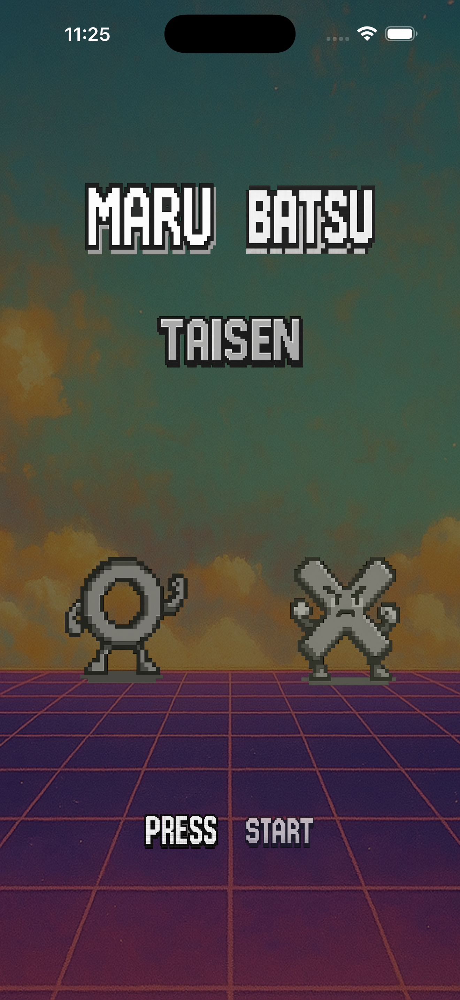
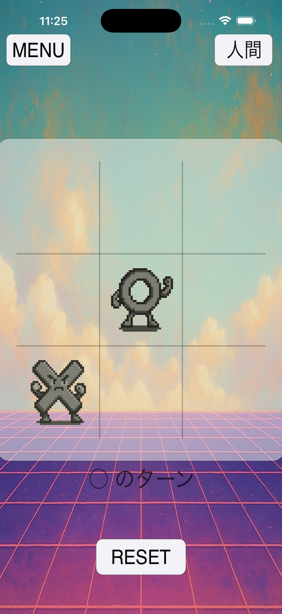
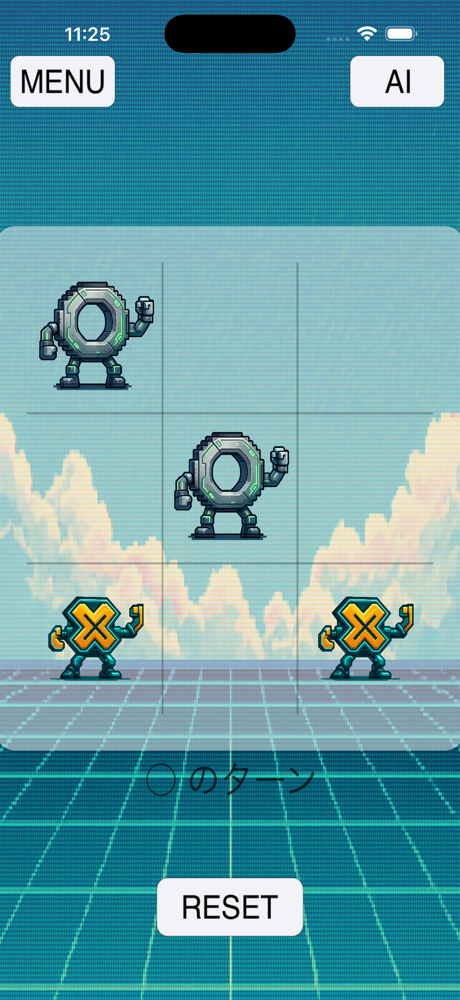
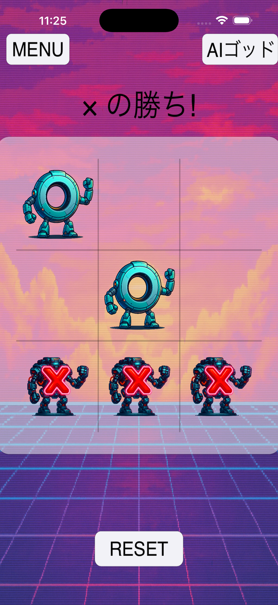

# まるばつ（○×）

SwiftUI と SpriteKit で作成した ○×ゲーム（三目並べ）です。  
二人対戦、AI 対戦、AI ゴッド対戦に対応しています。

---

## 動作環境
- iOS  
- Xcode でビルド・実行

---

## 画面

  
  
  
  

  タイトル ｜ 二人対戦 ｜ AI対戦 ｜ AIゴッド

---

## 主なファイル

- `ContentView.swift` — 画面切り替え  
- `GameScene.swift` — 盤面処理  
- `AIEngine.swift` / `AIGodEngine.swift` — AI ロジック
